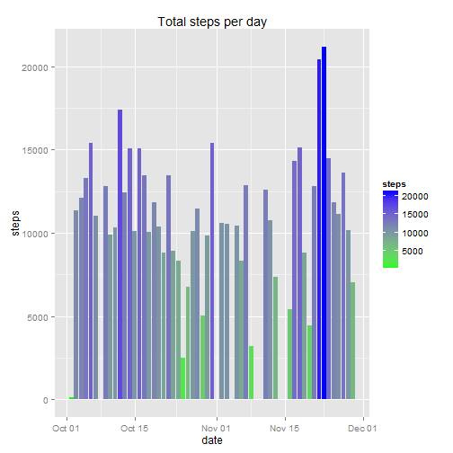
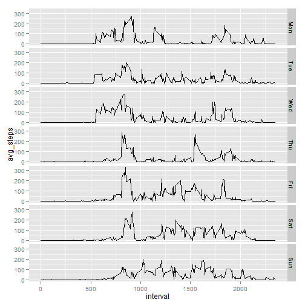
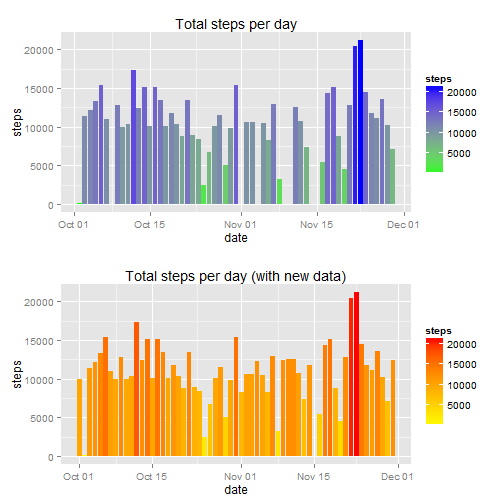
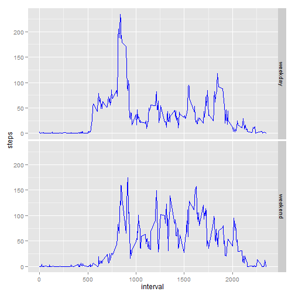

## Loading and preprocessing the data

```r
setwd("~/assignment")
mydata <- read.csv("activity.csv", sep = ",")

library(ggplot2)

### calculating data for histogram
stepsPerDay <- setNames(
aggregate(steps~as.Date(date),mydata,sum,na.rm = TRUE),c("date","steps"))

histo <- ggplot(stepsPerDay,aes(x=date,y=steps)) + aes(fill=steps) + scale_fill_gradient("steps", low = "green", high = "blue") + geom_bar(stat="identity") + ggtitle("Total steps per day")

print(histo)
```

 


## What is mean total number of steps taken per day?

```r
### cal mean and median of total steps per day
mm_1 <- c(mean = mean(stepsPerDay$steps),median = median(stepsPerDay$steps))

print(mm_1)
```

```
##     mean   median 
## 10766.19 10765.00
```


## What is the average daily activity pattern?

```r
require(scales)

avgPattern <- aggregate(steps~interval,mydata,mean,na.rm = TRUE)


avgPattern$time <- as.POSIXct(with(avgPattern,paste(interval %/% 100, interval %% 100, sep=":")),format="%H:%M")

myplot <- ggplot(avgPattern,aes(x=time,y=steps)) + geom_line() + scale_x_datetime(breaks = date_breaks("2 hour"),labels = date_format("%H:%M"))

print(myplot)
```

 

### 5 min interval that contains max no of steps 	

```r
with(avgPattern,avgPattern[steps == max(steps),])
```

```
##     interval    steps                time
## 104      835 206.1698 2014-12-14 08:35:00
```


## Imputing missing values
### calculate no of rows with NA

```r
steps <- mydata$steps
length(steps[is.na(steps)])
```

```
## [1] 2304
```

## strategy to fill missing values in dataset is to use avg steps on each day

```r
mydata$datetime <- as.POSIXct(
with(mydata,paste(date, paste(interval %/% 100, interval %% 100, sep=":"))),
format="%Y-%m-%d %H:%M",tz="")

ref_data <- aggregate(steps~interval+weekdays(datetime,abbreviate=TRUE),mydata,FUN=mean,na.rm=TRUE)

colnames(ref_data) <- c("interval","dow","avg_steps")

ref_data$dow <- factor(ref_data$dow,levels = c("Mon","Tue","Wed","Thu","Fri","Sat","Sun"))

ggplot(ref_data,aes(x=interval,y=avg_steps)) + geom_line() + facet_grid("dow ~ .")
```

 
## create new dataset with missing data filled

```r
mydata$dow <- weekdays(mydata$datetime,abbreviate=TRUE)

new <- merge(mydata,ref_data,by=c("dow","interval"),all.x = TRUE)

new <- new[with(new,order(date,interval)),]

new$fixed_steps <- ifelse(is.na(new$steps),new$avg_steps,new$steps)

### plot new dataset and compare with previous histo
stepsPerDay2 <- setNames(aggregate(fixed_steps~as.Date(date),new, sum, na.rm = TRUE), c("date","steps"))

histo2 <- ggplot(stepsPerDay2,aes(x=date,y=steps)) + aes(fill=steps) + scale_fill_gradient("steps", low = "yellow", high = "red") + geom_bar(stat="identity") + ggtitle("Total steps per day (with new data)")

library(grid)
### install.packages("gridExtra") if it's not installed
library(gridExtra)

grid.arrange(histo, histo2, nrow=2)
```

 

### cal new mean and median of total steps per day

```r
mm_2 <- c(mean = mean(stepsPerDay2$steps),median = median(stepsPerDay2$steps))

compare <- rbind(origin = mm_1, new = mm_2, delta = mm_2-mm_1)

print(compare)
```

```
##               mean median
## origin 10766.18868  10765
## new    10821.20960  11015
## delta     55.02092    250
```


## Are there differences in activity patterns between weekdays and weekends?
## create new factor in dataset with 'weekdays' and 'weekends'

```r
week_diff <- aggregate(steps~dow+interval, with(mydata, data.frame(dow = factor(
ifelse(weekdays(as.Date(date)) %in% c("Sunday","Saturday"), "weekend", "weekday")),
interval, steps)), FUN = mean, rm.na = TRUE)
```

## plot activity patterns for 'weekdays' and 'weekends'

```r
ggplot(week_diff,aes(x=interval,y=steps)) + geom_line(color = "blue") + facet_grid("dow ~ .")
```

 
