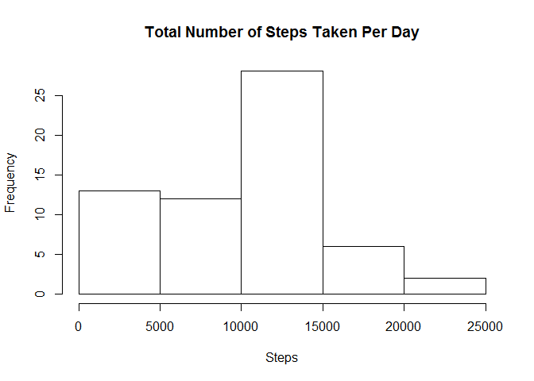
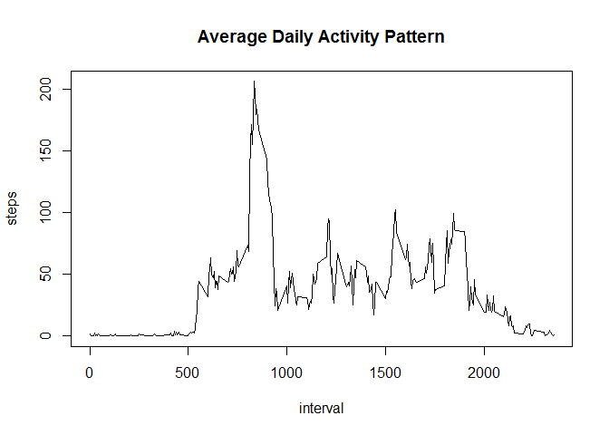
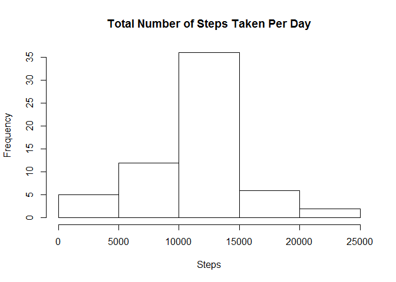
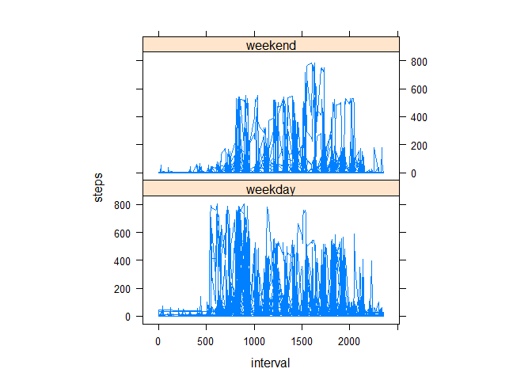

# Reproducible Research: Peer Assessment 1

# Reproducible Research: Peer Assessment 1

## Loading and preprocessing the data

```r
activity<-read.csv("activity.csv")
```
## What is mean total number of steps taken per day?

```r
library(dplyr)
```

```
## 
## Attaching package: 'dplyr'
```

```
## The following objects are masked from 'package:stats':
## 
##     filter, lag
```

```
## The following objects are masked from 'package:base':
## 
##     intersect, setdiff, setequal, union
```

```r
# Calculate the total number of steps taken per day
activity_date<-activity %>% group_by(date) %>% summarize(steps=sum(steps,na.rm=TRUE))
hist(activity_date$steps,xlab="Steps",main="Total Number of Steps Taken Per Day")
```



```r
# Calculate and report the mean and median of the total number of steps taken per day
mean(activity_date$steps)
```

```
## [1] 9354.23
```

```r
median(activity_date$steps)
```

```
## [1] 10395
```
## What is the average daily activity pattern?

```r
activity_interval<-activity %>% group_by(interval) %>% summarize(steps=mean(steps,na.rm=TRUE))
# Make a time series plot (i.e. type = "l") of the 5-minute interval (x-axis) and the average number of steps taken, averaged across all days (y-axis)
with(activity_interval,plot(steps~interval,type="l",main = "Average Daily Activity Pattern"))
```



```r
### Which 5-minute interval, on average across all the days in the dataset, contains the maximum number of steps?
activity_interval[which.max(activity_interval$steps),]$interval
```

```
## [1] 835
```
## Imputing missing values

```r
# 4.1 Calculate the total number of rows with NAs
sum(is.na(activity$steps))
```

```
## [1] 2304
```

```r
# 4.2 Filling missing value with mean for that 5-minute interval
activity_mean<-activity %>% group_by(interval) %>% summarize(mean_steps=mean(steps,na.rm=TRUE)) %>% merge(activity,by="interval",na.rm=TRUE)
activity_mean[is.na(activity_mean$steps),3]<-activity_mean[is.na(activity_mean$steps),2]
# 4.3 Create a new dataset with the missing data filled in
activity_new<-arrange(activity_mean[,-2],date)
# 4.4 Make a histogram of the total number of steps taken each day; Calculate and report the mean and median total number of steps taken per day
activity_new_date<-activity_new %>% group_by(date) %>% summarize(steps=sum(steps,na.rm=TRUE))
hist(activity_new_date$steps,xlab="Steps",main="Total Number of Steps Taken Per Day")
```



```r
mean(activity_new_date$steps)
```

```
## [1] 10766.19
```

```r
median(activity_new_date$steps)
```

```
## [1] 10766.19
```
Mean values increase as imputation used the average on 5-mi interval

## Are there differences in activity patterns between weekdays and weekends?

```r
activity_week<-activity_new %>% mutate(week_day=weekdays(as.Date(as.character(activity_new$date))))
# 5.1 Create a new factor variable in the dataset with two levels – “weekday” and “weekend”
activity_week[activity_week$week_day=='星期日' | activity_week$week_day=='星期六',4]<-'weekend'
activity_week[activity_week$week_day!='weekend',4]<-'weekday'
activity_week$week_day<-as.factor(activity_week$week_day)
# 5.2 Make a panel plot containing a time series plot of the 5-minute interval (x-axis) and the average number of steps taken, averaged across all weekday days or weekend days (y-axis).
library(lattice)
xyplot(steps~interval|factor(week_day),data=activity_week,aspect=1/2,type="l")
```


